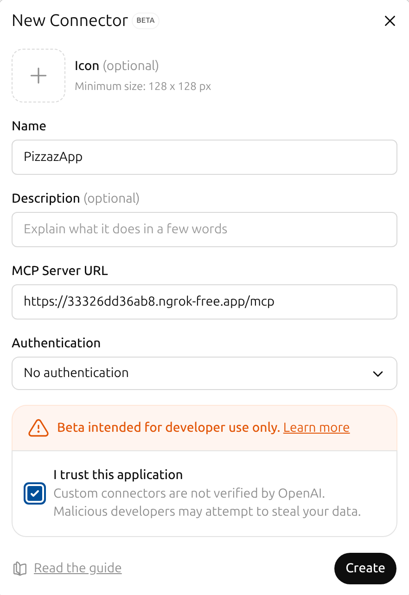
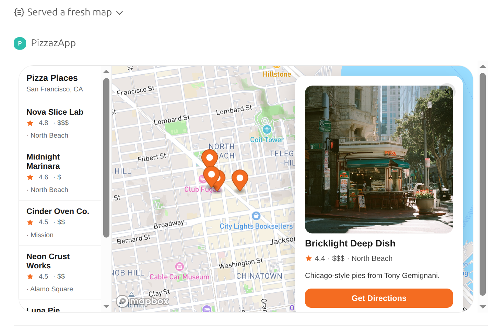
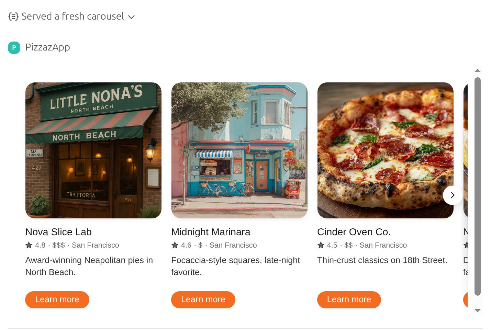
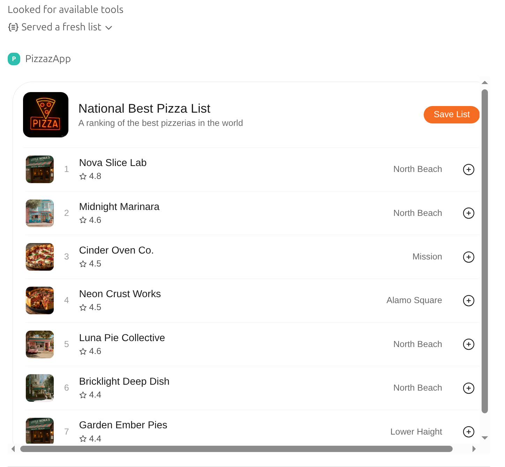

# Pizzaz MCP Server - OpenAI Apps SDK

A re-implementation of the [OpenAI Apps SDK Examples](https://github.com/openai/openai-apps-sdk-examples) using **[@rekog/mcp-nest](https://github.com/rekog/mcp-nest)** - a NestJS module for the MCP protocol.

## Usage

**1. Install and run**

```bash
cd pizzaz-openai-apps-sdk; npm i; npm start
```

**2. Local development preview**

View all widgets at: <http://localhost:8000/widgets/preview>

This preview page lets you view and test each widget individually during development.

**3. Expose via ngrok**

```bash
ngrok http 8000
```

**4. Register in ChatGPT**

Configure ChatGPT with your ngrok URL: `https://<your-id>.ngrok-free.app/mcp`



**5. Query in ChatGPT**

- "Show pizza places in map @PizzazApp"
- "Find me a pizza place in New York City @PizzazApp"
- "Show the pizza photos in carousel @PizzazApp"

Pizza Places Map:


Pizza Photos Carousel:


Pizza Places List:


## Technical Details

### Architecture with @rekog/mcp-nest

This project uses [@rekog/mcp-nest](https://github.com/rekog/mcp-nest), which provides NestJS decorators for building MCP servers. The library abstracts MCP protocol details into familiar NestJS patterns.

Each widget requires:

1. **Tool** - NestJS service method decorated with `@Tool()`
2. **Resource** - NestJS service method decorated with `@Resource()`
3. **Template** - Handlebars template that renders the HTML

### Tools with @Tool() Decorator

**Tools** ([pizzaz.tool.ts](src/pizzaz.tool.ts)) define ChatGPT-invokable functions using the `@Tool()` decorator from `@rekog/mcp-nest`:

```typescript
@Tool({
  name: 'pizza-map',
  description: 'Show Pizza Map',
  parameters: z.object({
    pizzaTopping: z.string(),
  }),
  _meta: {
    'openai/outputTemplate': 'ui://widget/pizza-map.html',
    'openai/widgetAccessible': true,
    'openai/resultCanProduceWidget': true,
  },
})
async showPizzaMap({ pizzaTopping }: { pizzaTopping: string }) {
  return {
    content: [{ type: 'text', text: 'Rendered a pizza map!' }],
    structuredContent: { pizzaTopping },
  };
}
```

The `_meta` field contains OpenAI-specific metadata:

- `openai/outputTemplate` - Points to the resource URI that provides the HTML
- `openai/widgetAccessible` - Makes the widget visible in ChatGPT
- `openai/resultCanProduceWidget` - Enables widget rendering

### Resources with @Resource() Decorator

**Resources** ([pizzaz.resource.ts](src/pizzaz.resource.ts)) serve HTML using the `@Resource()` decorator:

```typescript
@Resource({
  name: 'Show Pizza Map',
  description: 'Show Pizza Map widget markup',
  mimeType: 'text/html+skybridge',
  uri: 'ui://widget/pizza-map.html',
})
async getPizzaMap({ uri }: { uri: string }) {
  const data = this.widgetService.getSamplePizzaMap();
  const html = await this.widgetService.render('pizza-map', data);

  return {
    contents: [{
      uri,
      mimeType: 'text/html+skybridge',
      text: html,
    }],
  };
}
```

Resources return HTML with MIME type `text/html+skybridge`, which ChatGPT renders as an interactive widget.

### How Tools and Resources Connect

The `openai/outputTemplate` in a tool's `_meta` links to a resource's `uri`:

```typescript
// Tool metadata points to resource URI
_meta: {
  'openai/outputTemplate': 'ui://widget/pizza-map.html',
}

// Resource URI matches
@Resource({
  uri: 'ui://widget/pizza-map.html',
})
```

When ChatGPT invokes the tool, it fetches the resource at the specified URI to render the widget.

### Templating with Handlebars

Templates are stored in [views/widgets/](views/widgets/) as `.hbs` files. The `WidgetService`:

1. Reads templates from the filesystem
2. Compiles them using Handlebars
3. Renders them with data passed from resources

Example template structure:

```handlebars
<div id="widget-root">
  {{#each items}}
    <div>{{name}}: {{value}}</div>
  {{/each}}
</div>
```

### Available Widgets

- **pizza-map** - Interactive map with location markers
- **pizza-carousel** - Swipeable image carousel
- **pizza-list** - Ranked list with filtering
- **pizza-albums** - Photo album grid

Each widget can be previewed at `https://localhost:8000/widgets/preview/{widget-name}` for development.
